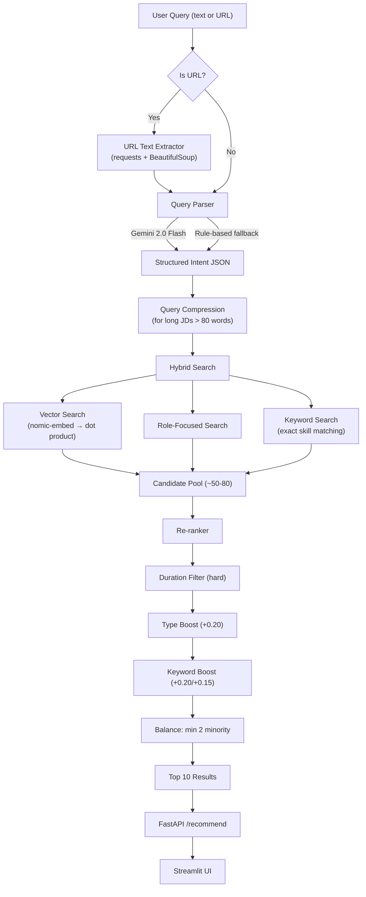

# SHL Assessment Recommendation Engine — Full Project Walkthrough

## What This Project Does

Given a **natural language query** (e.g. *"Python developer assessment under 30 min"*) or a **job description URL**, the system recommends up to **10 relevant SHL Individual Test Solutions** from a scraped catalogue of **389 assessments**. It's deployed on GCP with a FastAPI backend and Streamlit frontend.

---

## Architecture (End-to-End Flow)



---

## Module-by-Module Breakdown

### 1. Scraper — [scraper/scrape_catalogue.py](file:///c:/Users/PC/Desktop/Project/SHL%20Assignment/scraper/scrape_catalogue.py)

**Purpose**: Build the assessment catalogue from SHL's website.

| Stage | Tool | What it does |
|-------|------|-------------|
| Listing pages | **Selenium** (headless Chrome) | Paginates `?start=N&type=1` pages, extracts rows via JS |
| Detail pages | **requests + BeautifulSoup** | Fetches each assessment URL for `og:description` + duration |

**Output**: [scraper/catalogue.json](file:///c:/Users/PC/Desktop/Project/SHL%20Assignment/scraper/catalogue.json) — 389 assessments, each with:
- `name`, `url`, `remote_support`, `adaptive_support`
- `test_type` (array of canonical names like `"Knowledge & Skills"`)
- `description`, `duration` (int minutes or null)

> [!NOTE]
> Test type codes (`A`, `B`, `C`, `K`, `P`, `S`…) are mapped to full names via `TEST_TYPE_MAP`.

---

### 2. Embeddings — [engine/embeddings.py](file:///c:/Users/PC/Desktop/Project/SHL%20Assignment/engine/embeddings.py)

**Model**: `nomic-embed-text-v1.5` (GGUF Q8_0, ~140MB), loaded via `llama-cpp-python`. Produces **768-dim** vectors.

**Key design decisions**:
- **Lazy singleton**: model loaded once on first use, cached globally
- **Enriched embedding text**: `"search_document: {name}. Test type: {types}. {description}. Keywords: {domain_hints}"`
- **Domain hint enrichment**: each test type appends clustering keywords (e.g. `"Ability & Aptitude"` → `"cognitive reasoning analytical aptitude intelligence"`)
- **L2-normalized** at creation → cosine similarity = simple dot product
- **Prefix convention**: documents use `"search_document:"`, queries use `"search_query:"`

**Files produced**: [scraper/embeddings.npy](file:///c:/Users/PC/Desktop/Project/SHL%20Assignment/scraper/embeddings.npy) — shape `(389, 768)`

---

### 3. Search — [engine/search.py](file:///c:/Users/PC/Desktop/Project/SHL%20Assignment/engine/search.py)

Two search modes, both using lazy-loaded module-level state (`_catalogue`, `_embeddings`):

| Function | How it works |
|----------|-------------|
| `vector_search(query, top_k)` | Embeds query → `np.dot(embeddings, query_vec)` → argsort top-K |
| `keyword_search(skills, top_k)` | Scans all 389 assessments for exact substring matches in name/description |

> [!TIP]
> At 389 vectors × 768 dims, brute-force dot product takes ~0.1ms. No need for FAISS/ANN indexes.

---

### 4. Query Parser — [engine/query_parser.py](file:///c:/Users/PC/Desktop/Project/SHL%20Assignment/engine/query_parser.py)

**Dual-mode** parser extracts structured intent:

```json
{
  "job_role": "software developer",
  "skills_technical": ["python", "sql"],
  "skills_behavioral": ["leadership"],
  "max_duration": 40,
  "test_types_needed": ["Knowledge & Skills", "Personality & Behavior"],
  "requires_balance": true
}
```

| Mode | When used | How |
|------|-----------|-----|
| **Gemini 2.0 Flash** | API key present + API works | Structured prompt → JSON |
| **Rule-based fallback** | No key / API failure | Regex + keyword dictionaries |

**Notable enhancements**:
- Executive title detection (`COO`, `CEO`, `VP`, `Director`) → auto-adds `"leadership"` + `"Personality & Behavior"`
- Natural duration parsing: `"about an hour"` → 60, `"1-2 hours"` → 60
- Cultural fit terms → behavioral skill detection
- Fuzzy stem matching for skills (prefix-based)

---

### 5. Re-ranker — [engine/reranker.py](file:///c:/Users/PC/Desktop/Project/SHL%20Assignment/engine/reranker.py)

Four stages applied after hybrid search:

| Step | Type | Logic |
|------|------|-------|
| Duration filter | **Hard** | Remove candidates > `max_duration` (keep unknowns) |
| Type boost | **Soft** | `+0.20` per matching test type |
| Keyword boost | **Soft** | `+0.20` per skill keyword hit, `+0.15` extra for name match. Generic terms excluded. |
| Balance | **Structural** | If `requires_balance=true`, guarantee min 2 slots for minority group (tech vs behavioral) |

**Generic skill exclusion list**: `engineering`, `development`, `software`, `technology`, etc. — prevents noisy boosting on overly common terms.

---

### 6. Recommender (Pipeline Orchestrator) — [engine/recommender.py](file:///c:/Users/PC/Desktop/Project/SHL%20Assignment/engine/recommender.py)

This is the **central pipeline** that chains everything together:

```
1. parse_query(query)           → structured intent
2. compress_query(query, parsed) → shorter query for long JDs (>80 words)
3. vector_search (dual for long queries: compressed + original, merged by max score)
4. role_focused_search           → vector search with just role + skills + types
5. keyword_search               → exact skill matching (generic terms filtered)
6. rerank(candidates, parsed)    → duration filter + boosts + balance
7. Format output                → exact SHL field names
```

**Query compression** (for long JDs): extracts job role + known technologies + behavioral terms + test type context → ~10-20 words instead of 500+.

---

### 7. API — [api/main.py](file:///c:/Users/PC/Desktop/Project/SHL%20Assignment/api/main.py)

**FastAPI** app with:

| Endpoint | Method | Purpose |
|----------|--------|---------|
| `/health` | GET | Health check → `{"status": "healthy"}` |
| `/recommend` | POST | Accepts `{"query": "..."}`, returns `{"recommended_assessments": [...]}` |

**Features**:
- **Lifespan hook**: pre-loads embeddings on startup for fast first request
- **URL detection**: if query starts with `http://` or `https://`, fetches and extracts text via BeautifulSoup
- **CORS** enabled (allow all origins)
- **Pydantic models** for request/response validation

---

### 8. Frontend — [frontend/app.py](file:///c:/Users/PC/Desktop/Project/SHL%20Assignment/frontend/app.py)

**Streamlit** app that:
- Text area for query/URL input
- Calls the FastAPI backend at `/recommend`
- Displays results as cards with metrics (duration, remote support, adaptive support, test type)
- Custom CSS for card styling with colored badges

---

### 9. Evaluation — [eval/](file:///c:/Users/PC/Desktop/Project/SHL%20Assignment/eval)

| File | Purpose |
|------|---------|
| [evaluate.py](file:///c:/Users/PC/Desktop/Project/SHL%20Assignment/eval/evaluate.py) | Computes **Recall@10** and **MAP@10** on training data |
| [generate_predictions.py](file:///c:/Users/PC/Desktop/Project/SHL%20Assignment/eval/generate_predictions.py) | Produces `predictions.csv` for test set submission |

**URL normalization**: handles SHL's inconsistent URL patterns (`/solutions/products/` vs `/products/`).

**Results**: Baseline → Final: Mean Recall@10 `0.19 → 0.31` (+63%), MAP@10 `0.11 → 0.19` (+73%).

---

### 10. Tests — [tests/](file:///c:/Users/PC/Desktop/Project/SHL%20Assignment/tests)

7 test files covering all modules:

| File | Tests |
|------|-------|
| `test_api.py` | Health endpoint, /recommend response format, empty query handling |
| `test_recommender.py` | Output fields, test_type arrays, duration types, relevance, edge cases |
| `test_embeddings.py` | Embedding creation, normalization, model loading |
| `test_query_parser.py` | Duration extraction, skill detection, test type keywords, executive titles |
| `test_reranker.py` | Duration filtering, type/keyword boosting, balancing |
| `test_search.py` | Vector search results, keyword search, scoring |
| `test_scraper.py` | Catalogue validation, detail page parsing |

Tests use **mock catalogues** (3-5 sample assessments) with real embeddings created at fixture scope.

---

## Deployment

**Dockerfile**: Python 3.10-slim base → installs build tools for llama-cpp-python → installs pip deps → copies code → **pre-builds embeddings at image build time** → runs on port 8080.

**Live**: GCP Compute Engine (4 vCPU, 15GB RAM), API at `:8000`, Frontend at `:8501`.

---

## Key Files at a Glance

| File | Size | Role |
|------|------|------|
| `nomic-embed-text-v1.5.Q8_0.gguf` | 146 MB | Local embedding model |
| `scraper/catalogue.json` | 179 KB | 389 scraped assessments |
| `scraper/embeddings.npy` | 1.2 MB | Pre-computed 389×768 embeddings |
| `data/train.json` | 19 KB | Labelled training set |
| `data/test.json` | 19 KB | Unlabelled test set |
| `.env` | 49 B | Gemini API key |

---

## How to Run

```bash
pip install -r requirements.txt          # Install deps
python -m engine.embeddings              # Build embeddings (first time)
python -m uvicorn api.main:app --port 8000  # Start API
streamlit run frontend/app.py            # Start frontend
python -m pytest tests/ -v               # Run tests
python -m eval.evaluate --verbose        # Run evaluation
```
